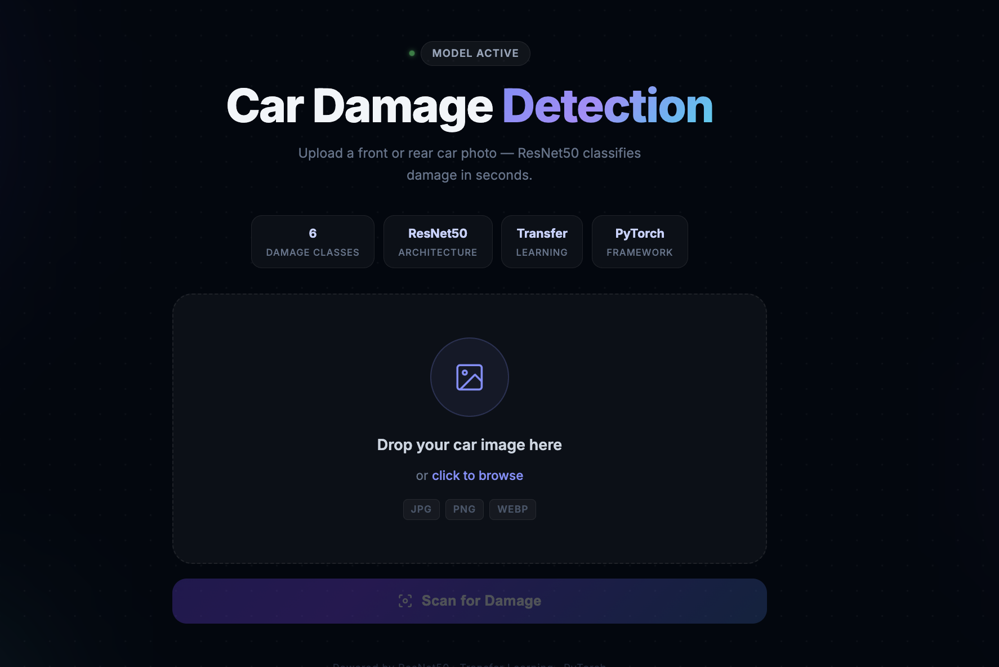
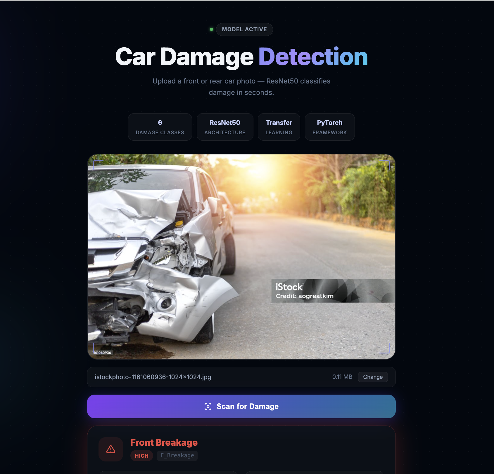
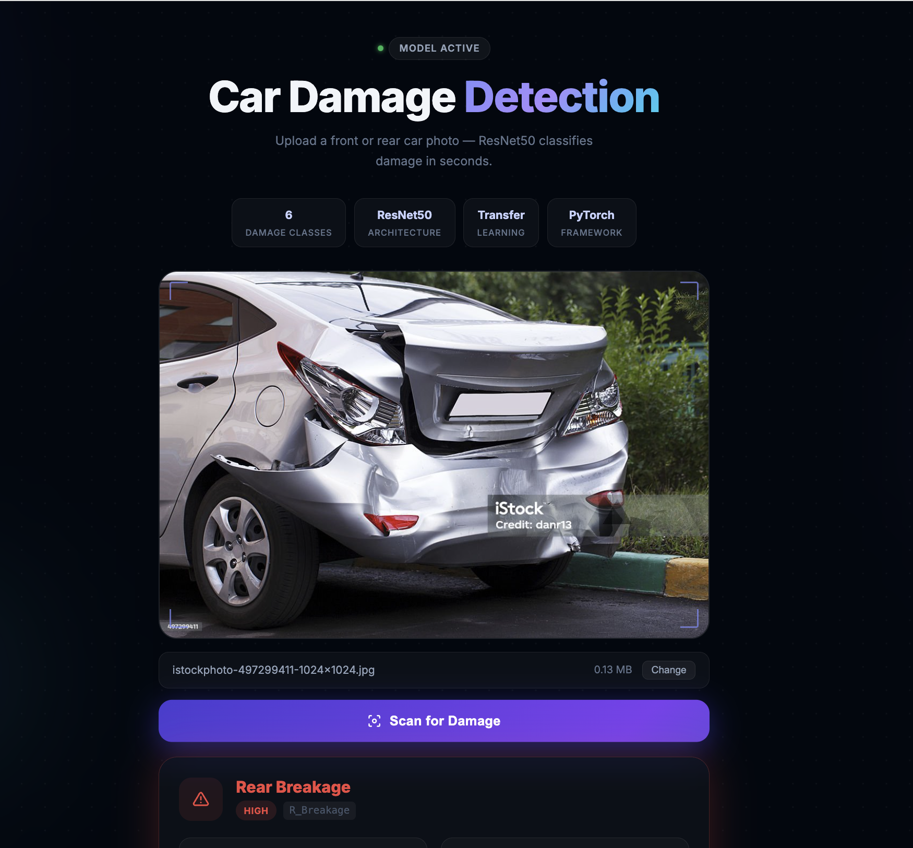
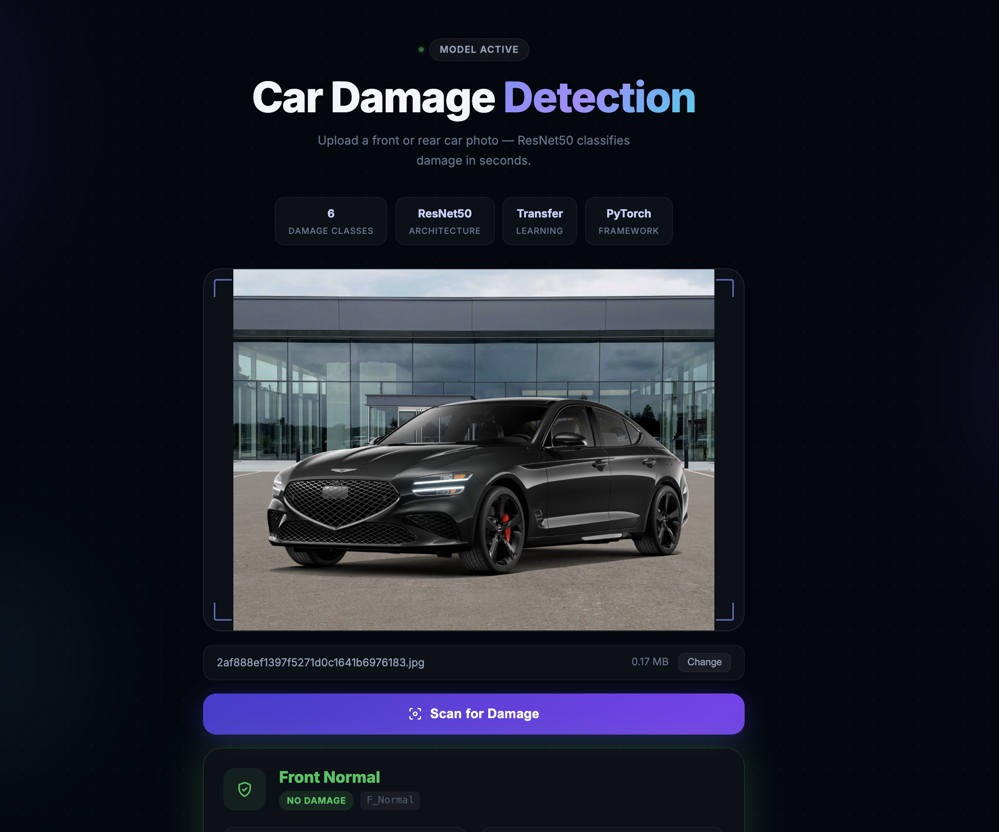
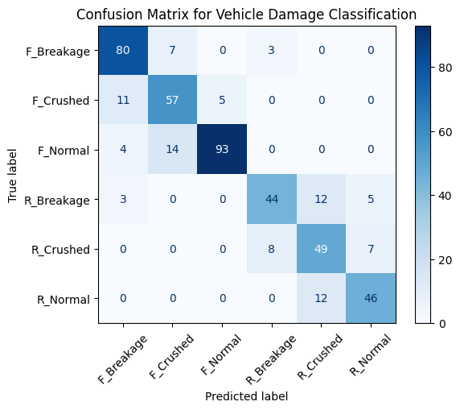

# Car Damage Detection

A deep learning project that classifies car damage from images using a fine-tuned ResNet50 model. Trained with transfer learning on a custom dataset of ~1,700 images across six damage categories, achieving **80% validation accuracy**.


---

## Demo



### Sample Predictions

| Front Breakage | Rear Breakage | No Damage |
|:---:|:---:|:---:|
|  |  |  |

---

## Problem Statement

Built as a POC for **VROOM Cars** — an automated vehicle condition assessment system that classifies front and rear car images into six damage categories, reducing manual inspection time and cost.

---

## Damage Classes

| Class | Description |
|---|---|
| `F_Normal` | Front — No damage |
| `F_Breakage` | Front — Structural breakage |
| `F_Crushed` | Front — Crush/deformation |
| `R_Normal` | Rear — No damage |
| `R_Breakage` | Rear — Structural breakage |
| `R_Crushed` | Rear — Crush/deformation |

---

## Model

### Architecture
- **Base:** ResNet50 pretrained on ImageNet
- **Transfer learning strategy:** All layers frozen except `layer4` (last residual block), fine-tuned on domain data
- **Custom classification head:**
  ```
  Dropout(p=0.2) → Linear(2048 → 6)
  ```

### Training Details

| Property | Value |
|---|---|
| Dataset size | ~1,700 images |
| Classes | 6 |
| Validation accuracy | **80%** |
| Hyperparameter tuning | Optuna |
| Framework | PyTorch 2.x |

### Confusion Matrix



### Image Preprocessing Pipeline
```python
transforms.Resize(256)
transforms.CenterCrop(224)
transforms.ToTensor()
transforms.Normalize(mean=[0.485, 0.456, 0.406], std=[0.229, 0.224, 0.225])
```
ImageNet normalization used since base model was pretrained on ImageNet.

---

## Project Structure

```
Car-Damage-Detection/
├── model/
│   ├── Car_Damage_Detection.ipynb      # Model training notebook
│   ├── hyperparameter_tunning.ipynb    # Optuna HPO experiments
│   └── saved_model.pth                 # Trained weights (~90MB)
├── fastapi-server/
│   ├── server.py                       # REST API serving the model
│   └── model_helper.py                 # Model definition + inference logic
├── frontend/
│   └── src/App.jsx                     # React UI (upload + results)
├── assets/                             # README screenshots
└── docker-compose.yml                  # Runs frontend + backend together
```

---

## Running Locally

**Backend:**
```bash
PYTHONPATH=fastapi-server uv run uvicorn server:app --reload --port 8000
```

**Frontend:**
```bash
cd frontend && npm install && npm run dev
```

Open `http://localhost:5173`

---

## API

### `POST /predict`

```
Content-Type: multipart/form-data
file: <car image>
```

```json
{ "prediction": "F_Crushed" }
```

---

## Deployment

The model is served via FastAPI and containerized with Docker. A React frontend communicates with the backend through an Nginx reverse proxy, deployed on AWS EC2. See [`DEPLOY.md`](DEPLOY.md) for the full guide.

---

## Client

**VROOM Cars** · Coordinated by Nikki Payne
Delivered by **AtliQ Technologies** · Fixed cost: $10,000 · Timeline: 5 weeks
